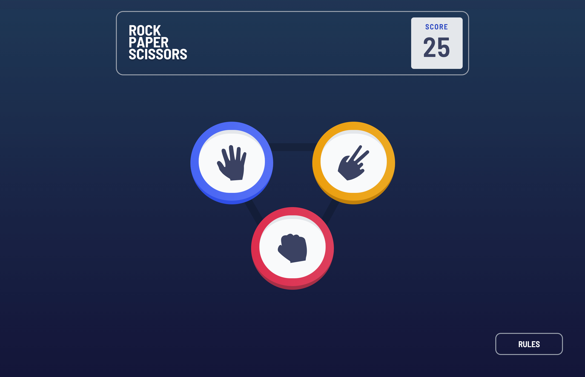

# Frontend Mentor - Rock, Paper, Scissors solution

This is a solution to the [Rock, Paper, Scissors challenge on Frontend Mentor](https://www.frontendmentor.io/challenges/rock-paper-scissors-game-pTgwgvgH).

## Table of contents

- [The challenge](#the-challenge)
- [Screenshot](#screenshot)
- [Links](#links)
- [Built with](#built-with)

## Overview

### The challenge

Users should be able to:

- View the optimal layout for the game depending on their device's screen size
- Play Rock, Paper, Scissors against the computer
- Maintain the state of the score after refreshing the browser _(optional)_ ✅
- **Bonus**: Play Rock, Paper, Scissors, Lizard, Spock against the computer _(optional)_ ❌

### Screenshot

### Links

- Solution: this repo 😆
- Live Site URL: [My Rock Paper Scissors game](https://your-live-site-url.com)

### Built with

- Angular
- TailwindCSS
- Semantic HTML5 markup
- CSS custom properties
- CSS Grid
- Mobile-first workflow
